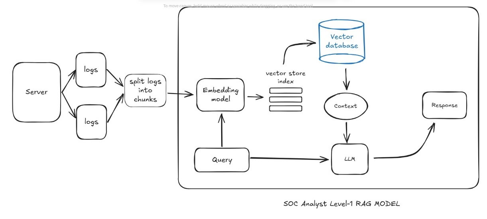

# SOC Analyst Level-1: AI-Powered RAG Model 🤖🛡️

## 📝 Project Overview
This repository contains a **Retrieval-Augmented Generation (RAG)** system designed to assist SOC Analysts in investigating server logs. Instead of manually searching through thousands of lines, the analyst can query the system in natural language to find anomalies, patterns, or specific security events.

## 🏗️ Architecture Breakdown
Based on the provided **RAG-Model**, the system follows this workflow:

1. **Data Ingestion**: Server logs are collected and **split into chunks** to maintain context and stay within LLM token limits.
2. **Embedding**: A specialized **Embedding Model** transforms text chunks into numerical vectors.
3. **Storage**: Vectors are indexed into a **Vector Store Index** and saved in a **Vector Database** (ChromaDB/FAISS).
4. **Retrieval & Context**: When a **Query** is made, the system searches the database for relevant logs, providing the **Context** to the model.
5. **Generation**: The **LLM** combines the original query with the retrieved context to produce a precise, grounded **Response**.

## 🗺️ Architecture Diagram


## 🛠️ Tech Stack
* **Language**: Python 3.12+
* **Vector DB**: ChromaDB (located in `/db_storage`)
* **Core Logic**: LangChain / Boto3
* **Containerization**: Docker & Docker Compose
* **Data**: Server Logs (Sample provided in `sample.pdf`)

## 🚀 Deployment (Docker)
To run the investigator locally:

1. Clone the repository.
2. Build and run the containers:
   ```bash
   docker-compose up --build
